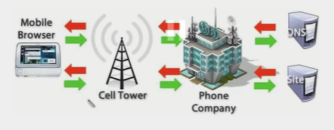

## How does the web work?

In Mobile:

Whenever we type something - and enter - then the request goes to the nearest tower of the sim company net

- which then goes to the phone compnay and which checks in DNS(Domain Name System - consists of mappins of names and IP address of website) - matches the IP - returns the corresponding html/css/js to the client and it is displayed in the browser.

